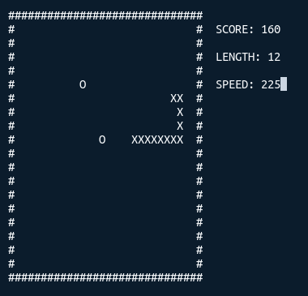

# termsnake

A simple Snake game for the command line.

## Build

Build using Cargo:

    $ cargo build --release
    1.5M target/release/termsnake

The executable still contains a lot of debug symbols. On Linux,
they can be removed with strip:

    $ strip target/release/termsnake
    363K target/release/termsnake

